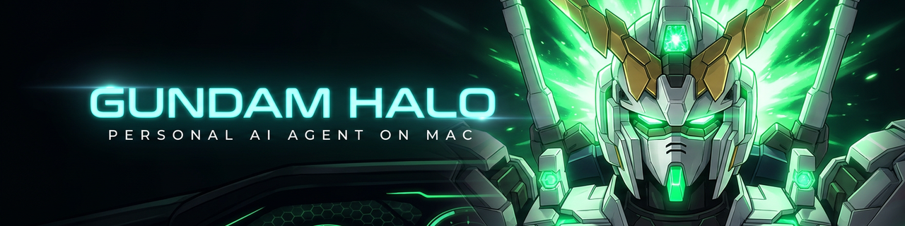
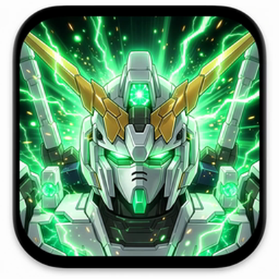
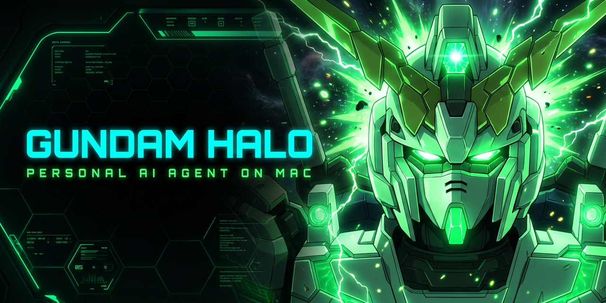

# Gundam Halo



> **Personal AI agent on Mac.** Hermes-like feel, MiniMax brain, deep Mac control, per-project isolation. Cockpit-themed dashboard.


<div align="center">

**Visual identity**

| Profile PFP | Open Graph card |
|:---:|:---:|
|  |  |
| `400×400` · `800×800` | `1280×640` — GitHub repo card, X/Twitter card |

</div>

---

## Why this exists

**Hermes Agent is great, but it gets messy with too many projects.** Single agent, single growing context, no project boundaries. Once you have 3+ active threads, context bleed starts to hurt.

**Gundam Halo is the second system** that solves this — same Hermes-feel conversational UX, but:

- **Per-project isolation** (each project = its own session, memory, context, archive)
- **Web UI dashboard** (replaces CLI / Textual)
- **Deeper Mac control** (file I/O, shell allowlist, AppleScript, Accessibility API, etc.)
- **MiniMax API as the only LLM backend** (no model shopping)
- **Remote control from phone** via Telegram + Tailscale
- **Cockpit-themed UI** (8 switchable Gundam themes — see Design below)

**Coexists with Hermes.** Never touch `~/.hermes/`.

---

## Status

🚧 **Active development — v0.1 milestone.** M1 (voice pipeline) ✅ · M2 (TTS) ✅ · M3 (Live2D + animated tray) ✅ · M3-B4..B8 (tool→motion, activity ticker feed, runtime FPS, settings UI) ✅. 194 backend tests passing, 0 TS errors, animated Unicorn Psycho-Frame tray icon live. See [ARCHITECTURE.md](./docs/ARCHITECTURE.md) for the full design spec and [changelog](./docs/ARCHITECTURE.md#14-changelog) for what's shipped.

---

## Architecture (planned)

```
┌────────────────────────────────────────────┐
│  Web UI  (Vite + React 19 + shadcn + Tauri)│
│  Telegram Bot                              │
│  Tailscale (remote)                        │
└──────────────────┬─────────────────────────┘
                   ↓ REST / WS
┌────────────────────────────────────────────┐
│  FastAPI Server  (Python 3.11+)            │
│  ┌──────────┬──────────┬──────────┬──────┐ │
│  │ Session  │ Project  │ Skills   │ Mac  │ │
│  │ Mgr      │ Workspace│ Registry │ Ctrl │ │
│  └────┬─────┴────┬─────┴────┬─────┴──┬───┘ │
│       └──────────┴──────────┴────────┘     │
│                  ↓                         │
│          MiniMax API (LLM brain)           │
└────────────────────────────────────────────┘
                   ↓
          Mac system
```

---

## Stack

| Layer | Choice |
|---|---|
| **Frontend** | Vite + React 19 + shadcn/ui + Tailwind v4 + Tauri 2 |
| **Backend** | FastAPI (Python 3.11+) |
| **LLM brain** | **MiniMax API** (OpenAI-compatible) |
| **Channels** | Telegram bot (primary), Signal (TBD) |
| **Remote access** | Tailscale (no public internet exposure) |
| **Storage** | Per-project workspace (path TBD) |
| **Project layout** | Forked from OpenJarvis architecture (registry + event bus + ABC contracts) |

### Mac control scope (all confirmed)

- File I/O (read/write anywhere, with path policy)
- Shell command execution (allowlist)
- `open <app>` to launch apps
- AppleScript automation
- Clipboard management
- System notifications
- Spotlight / file search
- Accessibility API (deep, requires permission)
- `git push` (handled by Mavis sub-agent)

---

## How this differs from siblings

| | **Hermes Agent** | **OpenJarvis** | **Gundam Halo (this)** |
|---|---|---|---|
| LLM | Nous Portal / OpenRouter / local vLLM | 5+ backends | **MiniMax only** |
| Context model | Single growing | Multi-agent, shared | **Per-project isolated** |
| UI | CLI + gateway daemon | Textual TUI + Web | **Web only, cockpit theme** |
| Mac control | Local terminal (basic) | Tools + security suite | **Deep (AppleScript, A11y, etc.)** |
| Scope | Personal AI, general | Research framework | **Personal Mac agent, focused** |
| Codebase | Independent | Independent | **Forks OpenJarvis architecture** |

---

## Design

Dashboard design lives at `~/workspace/gundam-design/`. The skill spec is `SKILL.md` (72KB, comprehensive design system).

**What we're getting:**

- 8 switchable Gundam themes:
  - NT-D / Unicorn (psychoframe)
  - SEED Freedom
  - Crossbone X-1
  - NT-D Green Frame
  - 00 Qubit
  - Destiny / Legend
  - God Gundam
  - Cartoon Kawaii
- 32 keyframe animations (scanning lines, target lock, damage flash, hex grid pulse, holo flicker, screen shake, data stream scroll, etc.)
- 363 assets across 24 categories (icons, HUD frames, gauges, radar, bursts, beams, backgrounds, MS silhouettes, etc.)
- 6 HTML+CSS component patterns (target reticle, gauges, rings, panels, radar, screen shake)
- CSS variable architecture + neon/glow techniques

**Asset library path:** `/Users/kencheng/hermes-workspace/assets/gundam-assets/`
**Manifest:** `/Users/kencheng/hermes-workspace/assets/gundam-assets/MANIFEST.md`

Theme will be selected at project init (or per-project, TBD).

---

## Project layout (planned)

```
gundam halo/
├── README.md                 # this file
├── .gitignore
├── ARCHITECTURE.md           # design decisions, will be written after dashboard design lands
├── backend/                  # FastAPI server
│   ├── app/
│   │   ├── main.py
│   │   ├── core/             # registry, events, config (forked from OpenJarvis)
│   │   ├── engines/          # MiniMax provider
│   │   ├── agents/           # per-project agent runners
│   │   ├── channels/         # Telegram / Signal bots
│   │   ├── mac/              # Mac control pane (file, shell, AppleScript, A11y)
│   │   ├── projects/         # workspace isolation
│   │   └── security/         # auth, audit, command allowlist
│   ├── tests/
│   └── pyproject.toml
├── frontend/                 # Vite + React 19 + shadcn
│   ├── src/
│   │   ├── components/
│   │   ├── pages/            # dashboard, project, settings, etc.
│   │   ├── stores/           # zustand
│   │   └── lib/
│   ├── src-tauri/            # Tauri 2 wrapper for desktop
│   └── package.json
└── deploy/                   # install scripts, Tailscale config, etc.
```

---

## Development

### Quick install (one shot)

```bash
curl -fsSL https://raw.githubusercontent.com/ihateusingai-beep/gundam-halo/main/install.sh | bash
```

Or clone + run locally:

```bash
git clone https://github.com/ihateusingai-beep/gundam-halo.git ~/workspace/gundam-halo
cd ~/workspace/gundam-halo
./install.sh                       # uv sync + config + .env
# ./install.sh --with-tailscale    # also print Tailscale hints
```

Prerequisites:

- **Python 3.11–3.13** (the backend uses tomllib / asyncio features)
- **uv** (install from <https://docs.astral.sh/uv/> if missing)
- **ffmpeg** (`brew install ffmpeg` on macOS — needed by Whisper ASR)
- **Node 20+** (only if you want to build the frontend / Tauri app)

### Day-to-day

```bash
# Backend
cd ~/workspace/gundam-halo/backend
.venv/bin/uvicorn app.main:app --reload --port 8765

# Frontend (separate terminal)
cd ~/workspace/gundam-halo/frontend
npx vite --port 5173

# Tauri desktop (the menu-bar tray app)
cd ~/workspace/gundam-halo/frontend
npx vite                              # in one terminal — Vite dev server
npm run tauri dev                     # in another — Tauri shell

# Smoke test (no LLM, no Telegram token needed)
python3 scripts/smoke_test.py
```

### Configuring

After install, edit:

- `~/.gundam-halo/config.toml` — all settings (LLM, Telegram, voice, Mac control, security). A working example is at [`config.toml.example`](./config.toml.example) in the repo.
- `~/.gundam-halo/.env` — secrets (MiniMax API key, optional Telegram bot token). **Never commit this file.**

The backend reads `config.toml` at startup; env vars override individual
fields (e.g. `MINIMAX_API_KEY` overrides `[llm] api_key_env`'s named
variable).

### Tailscale (for phone access)

```bash
brew install tailscale
tailscale up
# Then Tailscale ACL allows your phone to reach this Mac on port 8765
```

The dashboard runs on `http://<your-tailscale-hostname>:8765`. Open it
from any Tailscale-connected device.

### Telegram (optional — for chat-as-control-surface)

1. Message [@BotFather](https://t.me/BotFather) on Telegram, create a bot, get the token.
2. Set in `~/.gundam-halo/.env`:
   ```
   GUNDAM_HALO_TG_TOKEN=<your-token>
   ```
3. Add your `chat_id` to `config.toml [channels.telegram] allowed_chat_ids` (find it by messaging [@userinfobot](https://t.me/userinfobot)).
4. Set `[channels.telegram] enabled = true` in `config.toml`.
5. Restart the backend. Send `/start` then any text — the agent replies.

---

## Roadmap (rough)

- [x] Scaffold `backend/` (fork OpenJarvis minimal subset, swap engine to MiniMax) — done
- [x] Scaffold `frontend/` (Vite + React 19, cockpit theme baseline) — done
- [x] Per-project workspace isolation — done
- [x] Mac control pane (file I/O + shell allowlist) — done
- [x] Voice layer (VAD → ASR → TTS → Live2D) — done
- [x] Animated NT-D tray icon — done
- [x] Telegram bot + Tailscale auth — done (M4)
- [x] End-to-end smoke test — done (M5)
- [x] Visual identity (README banner, social card, PFP) — done
- [ ] Real Live2D model (Hiyori MIT, blocked on licensing revisit)
- [ ] Mobile voice input (v1.1 — Web Audio API / MediaRecorder)
- [ ] Persist tray FPS across restarts (v1.1)
- [ ] v0.5: confirm UX with real LLM + real Telegram, harden, ship
- [ ] v1.0: Signal channel, multi-user, persistence layer for memory

---

## Security notes

This system has **internet-facing shell access** via Telegram + Tailscale. The following are non-negotiable:

- All shell commands go through an **allowlist**
- All file writes go through a **path policy** (no writing to system dirs, SSH keys, etc.)
- **Per-action audit log** (who, what, when, what file/command)
- **Tailscale ACL** restricts which devices can reach the gateway
- **Telegram bot** only accepts commands from whitelisted chat IDs
- Accessibility API calls require explicit per-session grant

---

## Related

- `~/workspace/OpenJarvis/` — architecture reference (registry, event bus, multi-agent)
- `~/workspace/gundam-design/` — design system (SKILL.md, 363 assets, 8 themes)
- `~/.hermes/` — Hermes Agent data (do not touch)
- `~/hermes-workspace/assets/gundam-assets/` — Gundam design asset library

---

## License

[MIT](./LICENSE) — same as Hermes Agent. Do what you want, just keep the copyright notice.
